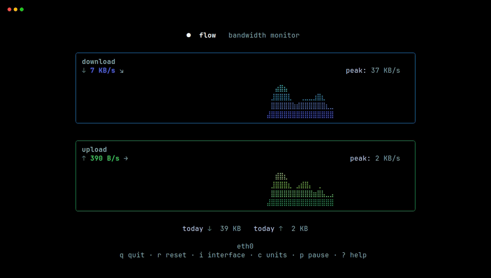
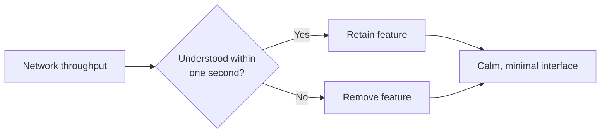
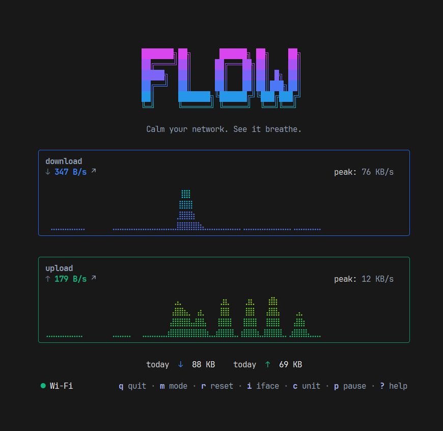
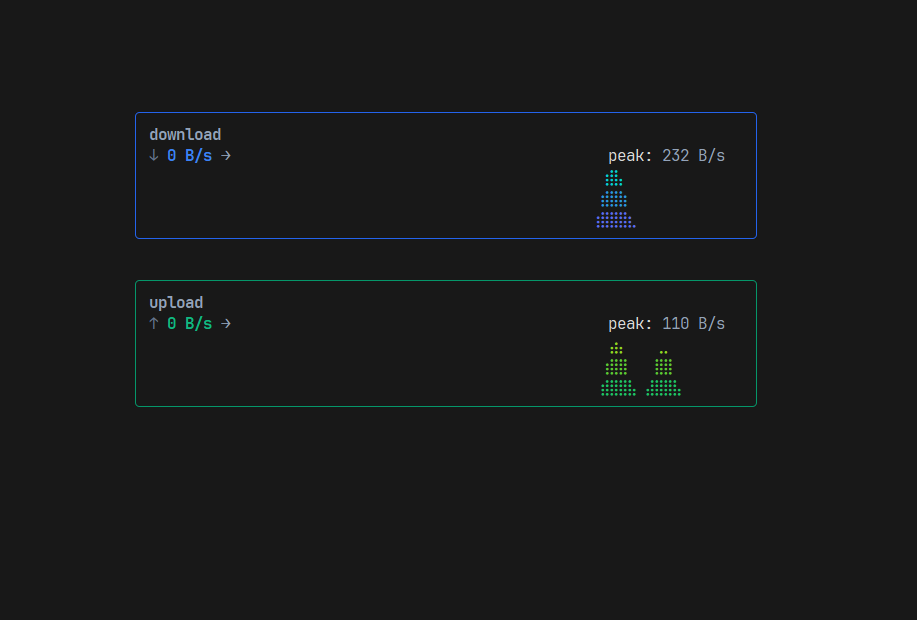
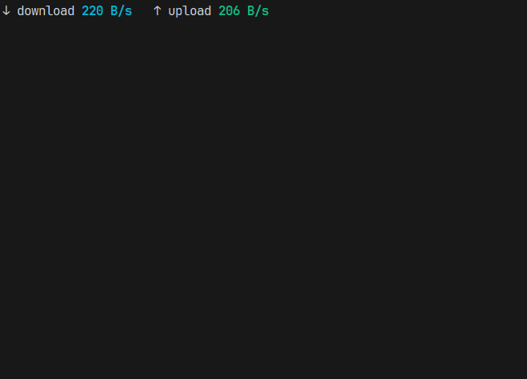
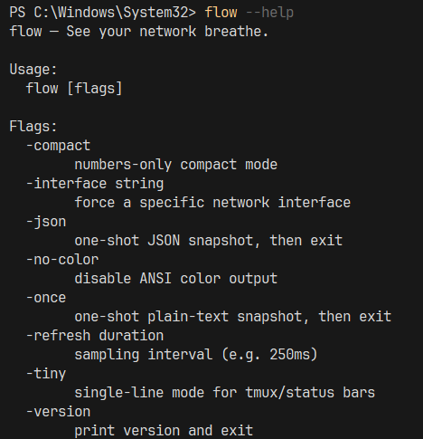
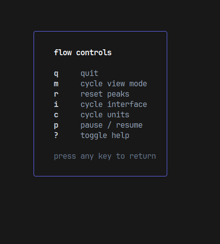
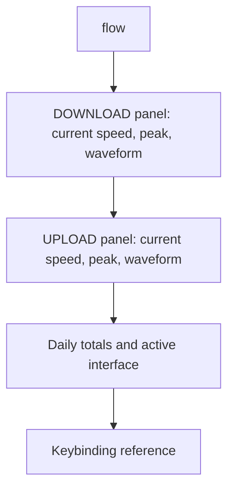
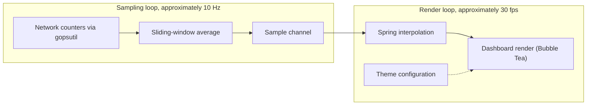

<div align="center">

### flow

*A terminal dashboard for real-time network throughput.*



<h3 align="center">
  Your Internet Stats, TUIfied.
</h3>

<p align="center">
  <i>Fast • Beautiful • Cross-Platform • Open Source</i>
</p>

</div>

<p align="center">
  <a href="https://github.com/programmersd21/flow/actions">
    
  </a>
  <a href="https://github.com/programmersd21/flow/releases">
    
  </a>
  <a href="https://github.com/programmersd21/flow/releases">
    
  </a>
  <a href="https://github.com/programmersd21/flow/stargazers">
    
  </a>
</p>

<p align="center">
  <a href="https://github.com/programmersd21/flow">
    
  </a>
  <a href="https://github.com/programmersd21/flow/blob/main/LICENSE">
    
  </a>
  <a href="https://github.com/programmersd21/homebrew-flow">
    
  </a>
  <a href="https://aur.archlinux.org/packages/flow-network-monitor-bin">
    
  </a>
  <a href="https://aur.archlinux.org/packages/flow-network-monitor-bin">
    
  </a>
</p>

## Contents

- [Install](#install)
- [Rationale](#rationale)
- [Philosophy](#philosophy)
- [Modes](#modes)
- [Features](#features)
- [Usage](#usage)
- [Configuration](#configuration)
- [Architecture](#architecture)
- [Development](#development)
- [Star History](#star-history)
- [License](#license)

## Install

1. AUR:

```sh
yay -S flow-network-monitor-bin
```

**💝 Thanks to [@Dominiquini](https://github.com/Dominiquini) for assisting in AUR deployment!**

2. Homebrew:

```sh
brew install programmersd21/flow/flow
```

3. Go:

```sh
go install github.com/programmersd21/flow/cmd/flow@latest
```

4. From source:

```sh
git clone https://github.com/programmersd21/flow
cd flow
make install
```

Pre-built binaries for Linux, macOS, and Windows (amd64 and arm64) are available on the [releases page](https://github.com/programmersd21/flow/releases).

## Rationale

Most network monitors display CPU usage, per-process breakdowns, packet counts, and connection tables. flow displays throughput only.

Every feature decision is evaluated against a single question: does this help the user understand their network within one second. If not, it is not included.

The result is a small, deliberately scoped tool. There are no additional panels, no required configuration, and no unnecessary complexity in either the interface or the underlying implementation.

## Philosophy



Every feature is evaluated against one question: does this help a user understand their network within one second. If not, it is removed.

flow does not include CPU panels, packet counters, or multi-pane layouts. It reports download and upload throughput, in real time, and nothing else.

The interface is built for restraint rather than density: large typography, controlled color, and spring-based motion in place of decoration.

## Modes

flow adjusts its display according to terminal width and height.

| hero | compact | mini | tiny |
|:---:|:---:|:---:|:---:|
|  |  | |  |
| Full dashboard with logo branding, waveforms, peaks, and daily totals | Cleaner layout with title row, waveforms, peaks, and daily totals | Graphs-only layout, hiding header logo, today's summary, and help footers | Single-line output, intended for status bars |

## Features

- Real-time download and upload throughput
- Interpolated display values using spring-based animation
- Braille-grid waveform rendering at 30 frames per second
- Border color reflects current transfer speed with sleek, modern rounded outlines
- Live peak pulsing white-flash animations when a new session peak is reached
- Minimalist, high-end unicode today statistics and navigation footer
- Directional indicators for traffic trend
- Automatic unit scaling from B/s to GB/s
- Session peak tracking and daily traffic totals
- Four display modes with automatic responsive switching on both width and height resize
- No required configuration; optional TOML configuration file
- Non-interactive output modes for use in scripts
- Supported on Linux, macOS, and Windows

## Usage



```sh
flow                        # hero view, auto interface
flow --tiny                 # single-line mode for status bars
flow --mini                 # graphs-only mode, no headers/footers
flow --compact              # compact layout with title row and waveforms
flow --json                  # single JSON output, then exit
flow --once                  # single plain-text output, then exit
flow --interface wlan0       # specify network interface
flow --refresh 500ms         # adjust sampling interval (default 100ms)
flow --no-color
flow --version
flow --help
```

### Keybindings



| Key         | Action                      |
|-------------|-----------------------------|
| `q` / `^C`  | Quit                         |
| `m`         | Cycle display/view modes    |
| `r`         | Reset session peaks          |
| `i`         | Cycle network interfaces     |
| `c`         | Cycle display units          |
| `p`         | Pause or resume              |
| `?`         | Toggle help                  |

### JSON output

```json
{
  "download_bps": 124300000,
  "upload_bps": 18400000,
  "peak_down_bps": 320000000,
  "peak_up_bps": 48000000,
  "interface": "wlan0",
  "unit_display": "MB/s"
}
```

### tmux integration

```sh
# ~/.tmux.conf
set -g status-right "#(flow --tiny --no-color)"
set -g status-interval 1
```

## Configuration

A configuration file is created automatically on first run:

| Platform | Path |
|----------|------|
| Linux | `~/.config/flow/config.toml` |
| macOS | `~/Library/Application Support/flow/config.toml` |
| Windows | `%APPDATA%\flow\config.toml` |

The `XDG_CONFIG_HOME` environment variable is respected on Linux if set.

```toml
refresh   = "100ms"   # sampling interval
history   = 60        # seconds of retained sparkline history
theme     = "default"
unit      = "auto"    # auto, kb, mb, or gb
interface = "auto"    # auto, or a specific interface name (e.g. eth0, wlan0)
no_color  = false
```

<details>
<summary>Interface layout</summary>



All elements are centered on both axes. Panel border color changes according to current transfer speed.

</details>

## Architecture

flow runs two independent loops connected by a channel.



- The sampling loop reads network counters from the operating system, computes a sliding-window average, and emits a sample on a channel.
- The render loop interpolates display values toward the latest sample and renders the dashboard.

Separating collection from rendering keeps the interface responsive without adding load to the sampler. Idle CPU usage remains below one percent.

**Platform notes:** Linux reads `/proc/net/dev` via gopsutil. macOS uses sysctl and getifaddrs. Windows uses `GetIfTable2`. No elevated privileges are required on any platform.

## Development

```sh
make check       # format check, vet, lint, and test
make build       # build ./bin/flow
make test        # go test ./... -race -cover
make release-dry # goreleaser snapshot build, no publish
```

See [CONTRIBUTING.md](CONTRIBUTING.md) for contribution guidelines.

## 💙 Community & Support

Thank you to everyone who has supported **flow**. Whether you've starred the repository, reported an issue, submitted a pull request, shared the project, or simply use it every day—your support is what keeps the project growing.

### ⭐ Stargazers

<p align="center">
  <a href="https://github.com/programmersd21/flow/stargazers">
    
  </a>
</p>

### ❤️ Sponsor

If **flow** has made your terminal a little better, please consider sponsoring its development on GitHub.

Your sponsorship helps support:

- 🚀 New features
- 🐛 Bug fixes
- ⚡ Performance improvements
- 📖 Better documentation
- 🛠️ Long-term maintenance

If you're unable to sponsor, you can still make a huge difference by:

- ⭐ Starring the repository
- 📢 Sharing **flow** with others
- 💬 Recommending it to friends and colleagues
- 🐞 Reporting bugs or suggesting improvements
- 🤝 Contributing code or documentation

Every contribution, no matter how small, helps **flow** continue to grow.

**Thank you for supporting open source. ❤️**

## License

MIT. See [LICENSE](LICENSE).
