<div align="center">

### • flow •

*A terminal dashboard for real-time network throughput.*
<p align="center">
  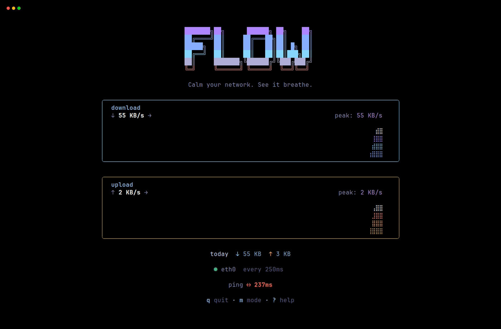
</p>

<p align="center">
  <a href="https://trendshift.io/repositories/72650?utm_source=trendshift-badge&amp;utm_medium=badge&amp;utm_campaign=badge-trendshift-72650" target="_blank" rel="noopener noreferrer">
    
  </a>
  &nbsp;&nbsp;&nbsp;
  <a href="https://terminaltrove.com/flow">
    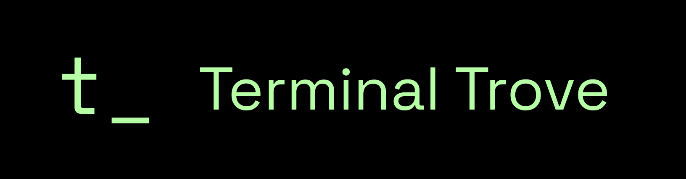
  </a>
</p>

<p align="center">
  
  
  
  
</p>
<p align="center">
  
  
  
  
</p>

**[Install](#install) · [Usage](#usage) · [Configuration](#configuration) · [Architecture](#architecture) · [Contributing](CONTRIBUTING.md)**

</div>

---

## Rationale

Most network monitors show CPU, memory, per-process breakdowns, and connection tables alongside throughput. `flow` shows throughput. Nothing else.

| btop | flow |
|:---:|:---:|
| 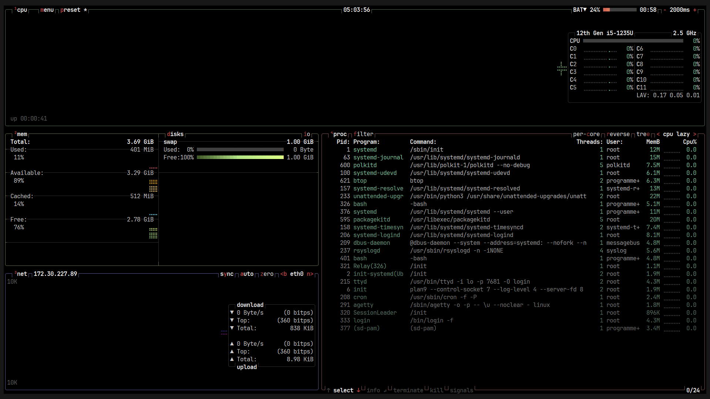 | 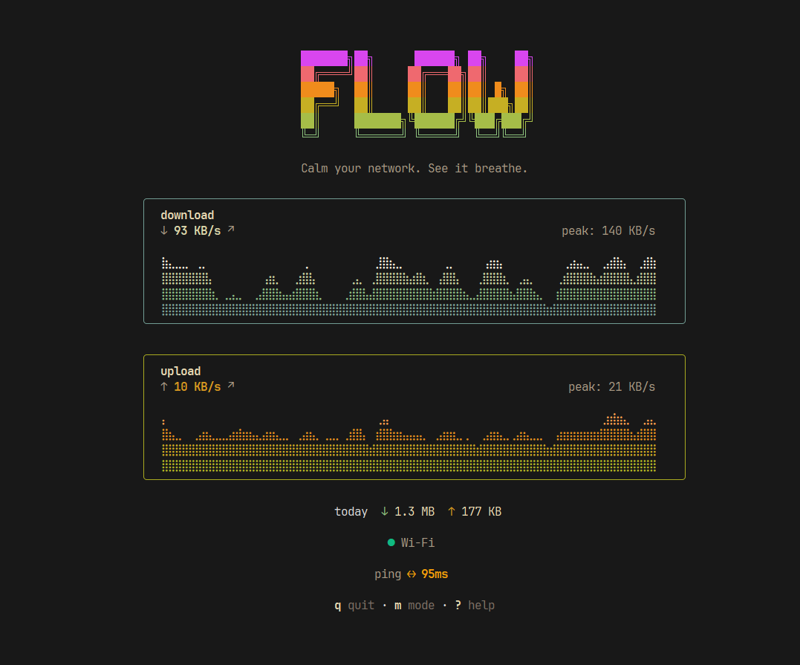 |
| CPU, memory, disks, processes, network | throughput only |

Every feature is weighed against one question: **does this help you read your network within one second?** If not, it doesn't ship.

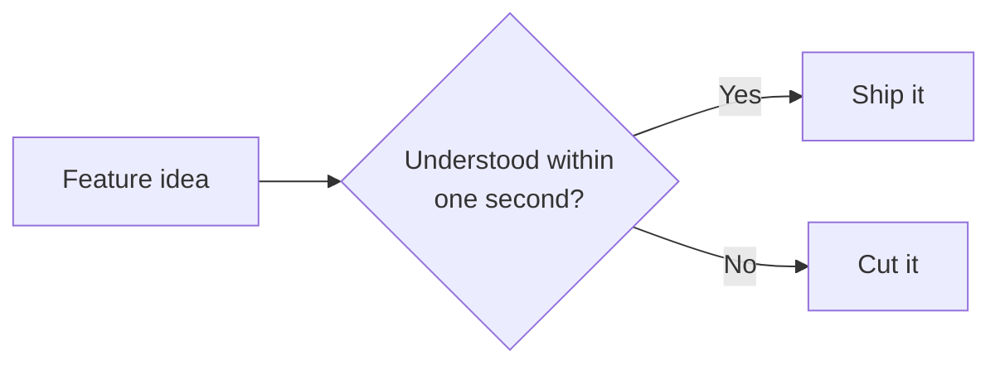

## Install

**Arch Linux (AUR)**
```sh
yay -S flow-network-monitor-bin
```
> Thanks to [@Dominiquini](https://github.com/Dominiquini) for maintaining the AUR package.

**Homebrew**
```sh
brew install programmersd21/flow/flow
```

**Go**
```sh
go install github.com/programmersd21/flow/cmd/flow@latest
```

**From source**
```sh
git clone https://github.com/programmersd21/flow
cd flow
make install
```

Pre-built binaries for Linux, macOS, and Windows (amd64/arm64) are on the [releases page](https://github.com/programmersd21/flow/releases).

## Modes

`flow` adjusts its display to terminal width and height automatically.

| hero | compact | mini | tiny |
|:---:|:---:|:---:|:---:|
| 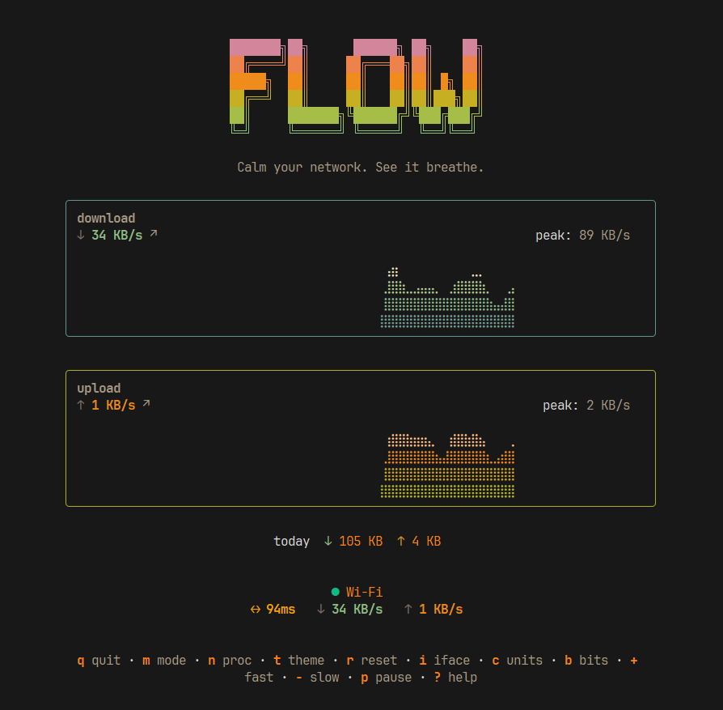 | 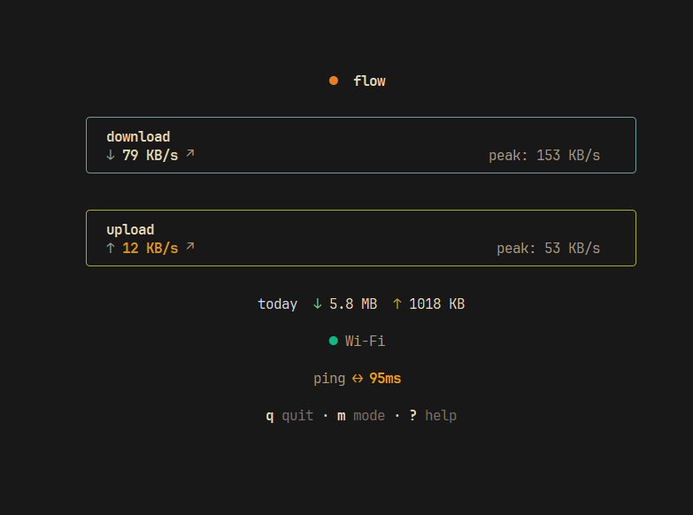 | 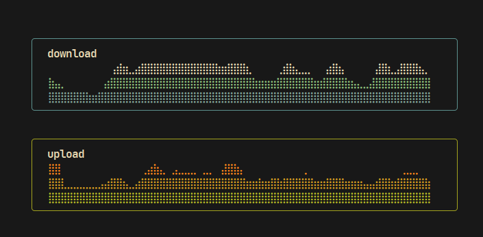 | 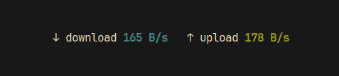 |
| Full dashboard, waveforms, peaks, daily totals | Numbers-only layout with peaks and totals | Waveforms only, no header or footer | Single-line, built for status bars |

## Features

- Real-time download/upload throughput with spring-smoothed animation
- Braille-grid waveform rendering at 30 FPS
- Live latency (ping) indicator, configurable target
- Network processes panel (`n`) — active connections sorted by count
- Interface details overlay (`I`) — IP, MAC, link status, MTU
- 8 built-in themes plus custom themes via TOML
- Session peak tracking and daily totals, persisted across restarts
- Streaming JSON output (`--json-stream`) for pipelines
- Four responsive display modes, switching on both width and height
- Zero required configuration
- Linux, macOS, and Windows — no elevated privileges required

<p align="center">
  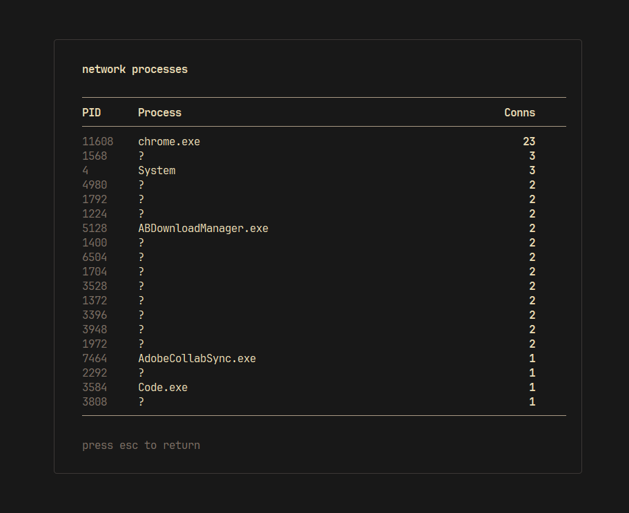
  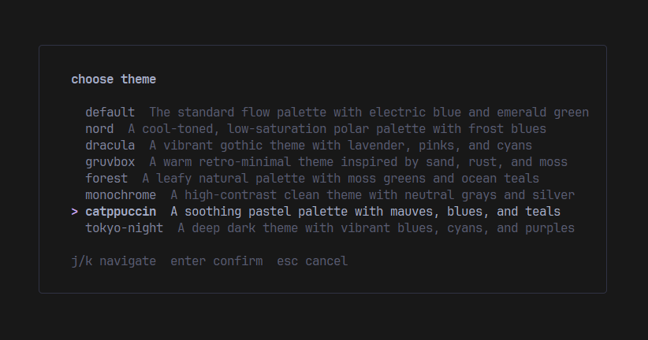
  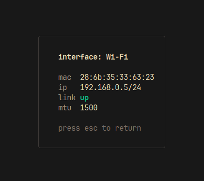
</p>

## Usage

```sh
flow                        # hero view, auto interface
flow --tiny                 # single-line mode for status bars
flow --mini                 # graphs-only mode
flow --compact              # compact layout
flow --json                 # single JSON output, then exit
flow --json-stream          # continuous JSON lines
flow --once                 # single plain-text output, then exit
flow --interface wlan0      # specify network interface
flow --ping 8.8.8.8          # latency target
flow --refresh 500ms        # sampling interval (default 100ms)
flow --bits                 # bits/sec instead of bytes/sec
flow --no-color
flow --version
flow --help
```

### Keybindings

| Key | Action | Key | Action |
|---|---|---|---|
| `q` / `^C` | Quit | `c` | Cycle display units |
| `m` | Cycle display modes | `b` | Toggle bits/bytes |
| `n` | Network processes | `+` / `-` | Adjust refresh interval |
| `t` | Choose theme | `p` | Pause / resume |
| `i` | Cycle interfaces | `?` | Help |
| `I` | Interface info | `esc` | Back / close overlay |
| `r` | Reset peaks (press twice) | | |

### JSON output

```json
{
  "download_bps": 124300000,
  "upload_bps": 18400000,
  "peak_down_bps": 320000000,
  "peak_up_bps": 48000000,
  "interface": "wlan0",
  "unit_display": "MB/s"
}
```

### tmux

<p align="center">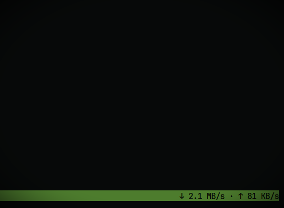</p>

```sh
# ~/.tmux.conf
set -g status-right "#(flow --tiny --no-color)"
set -g status-interval 1
```

## Configuration

Created automatically on first run.

| Platform | Path |
|---|---|
| Linux | `~/.config/flow/config.toml` |
| macOS | `~/Library/Application Support/flow/config.toml` |
| Windows | `%APPDATA%\flow\config.toml` |

`XDG_CONFIG_HOME` is respected on Linux if set.

```toml
refresh     = "100ms"
history     = 60
theme       = "default"
unit        = "auto"    # auto, kb, mb, gb
interface   = "auto"
no_color    = false
bits        = false
ping_target = "1.1.1.1"
```

**Custom themes** — drop `.toml` files in `~/.config/flow/themes/`:

```toml
name = "my-theme"
text_dim    = "#64748b"
text_muted  = "#94a3b8"
text_soft   = "#cbd5e1"
text_base   = "#e2e8f0"
text_bright = "#f8fafc"
text_pure   = "#ffffff"
border      = "#334155"
accent      = "#6366f1"
download    = ["#3b82f6", "#6366f1", "#06b6d4", "#00f5d4", "#ffffff"]
upload      = ["#10b981", "#22c55e", "#84cc16", "#a3e635", "#ffffff"]
```

## Architecture

Two independent loops connected by a channel — sampling never blocks rendering.

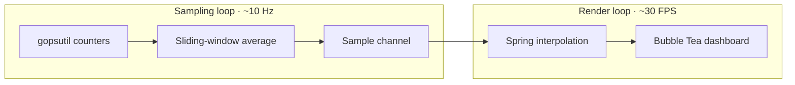

```
cmd/flow/main.go
├── internal/config       TOML config management
├── internal/collector    OS-level I/O counters + interface details
├── internal/sampler      Sliding-window sampling loop
└── internal/ui           Bubble Tea model + views
    ├── model.go          State, update loop, key handling
    ├── views.go          Layout and mode selection
    ├── panels.go         Download/upload rendering
    ├── overlays.go       Help, processes, themes, interface info
    ├── internal/history     Ring buffer + peak/total tracker
    ├── internal/sparkline   Braille/block graph rendering
    ├── internal/theme       Colour themes + lipgloss styles
    ├── internal/animate     Spring physics, easing, colour lerp
    ├── internal/ping        TCP ping measurement
    └── internal/processes   Network process enumeration
```

Idle CPU usage stays below 1%. **Linux** reads `/proc/net/dev` via gopsutil. **macOS** uses sysctl/getifaddrs. **Windows** uses `GetIfTable2`.

## Development

```sh
make check       # format, vet, lint, test
make build       # build ./bin/flow
make test        # go test ./... -race -cover
make release-dry # goreleaser snapshot, no publish
```

See [CONTRIBUTING.md](CONTRIBUTING.md).

## Star History

<a href="https://www.star-history.com/?repos=programmersd21%2Fflow&type=date&legend=top-left">
 <picture>
   <source media="(prefers-color-scheme: dark)" srcset="https://api.star-history.com/chart?repos=programmersd21/flow&type=date&theme=dark&legend=top-left" />
   <source media="(prefers-color-scheme: light)" srcset="https://api.star-history.com/chart?repos=programmersd21/flow&type=date&legend=top-left" />
   
 </picture>
</a>

## License

MIT — see [LICENSE](LICENSE).
