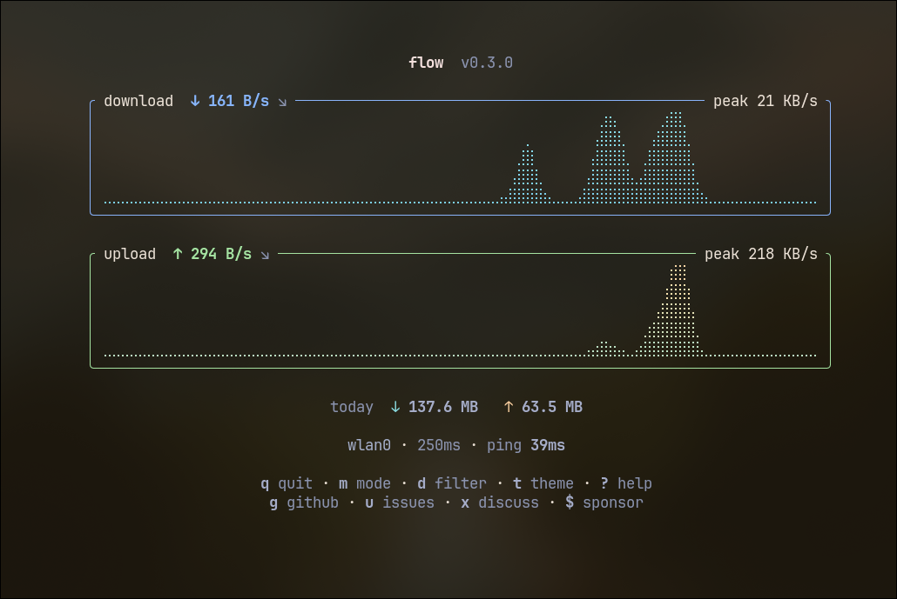

<div align="center">

# flow

**Real-time network throughput in your terminal.**



<br>

[](https://github.com/programmersd21/flow/actions)
[](https://github.com/programmersd21/flow/releases)
[](https://github.com/programmersd21/flow)
[](LICENSE)

</div>

## install

**arch linux**

```sh
yay -S flow-network-monitor-bin
```

**homebrew**

```sh
brew install programmersd21/flow/flow
```

**go**

```sh
go install github.com/programmersd21/flow/cmd/flow@latest
```

or download a binary from [releases](https://github.com/programmersd21/flow/releases).

## usage

```sh
flow
flow --tiny
flow --mini
flow --compact
flow --json
flow --json-stream
```

### tmux

```sh
set -g status-right "#(flow --tiny --no-color)"
```

## features

* **Silky 20 FPS Animations**: Sub-pixel smooth graph updates driven by spring dynamics
* **Airy Unixporn Aesthetic**: Open, spacious typography with clean left-stripe accent indicators
* **11 Built-in Themes**: `default`, `nord`, `dracula`, `gruvbox`, `forest`, `monochrome`, `catppuccin`, `tokyo-night`, `rose-pine`, `kanagawa`, `ansi`
* **Custom TOML Themes**: Load custom color schemes from your config directory
* **Network Processes**: Active connection viewer by PID and process name (`n`)
* **Interface Inspector**: Real-time IP address, MAC, MTU, and link state viewer (`I`)
* **Responsive Layouts**: Auto-adapts between Hero, Compact, Mini, and Tiny modes
* **Zero Overhead**: Minimal CPU and memory usage (written in Go with Bubble Tea)
* **Cross-Platform**: Linux, macOS, and Windows support

## keys

| key | action |
| :-: | ------ |
| `q` | quit |
| `m` | cycle view mode |
| `d` | cycle display filter (both / down / up) |
| `t` | theme selector |
| `n` | network processes inspector |
| `i` | cycle network interface |
| `I` | interface details |
| `c` | cycle unit scale (auto / B/s / KB/s / MB/s) |
| `b` | toggle bits/sec vs bytes/sec |
| `+` / `-` | adjust sampling interval |
| `p` | pause / resume sampling |
| `r` | reset peak counters (press twice) |
| `g` | open GitHub repository in browser |
| `u` | open GitHub issues in browser |
| `x` | open GitHub discussions in browser |
| `$` / `v` | sponsor / donate on GitHub |
| `?` | help menu |

## configuration

Created automatically on first run:

```text
Linux    ~/.config/flow/config.toml
macOS    ~/Library/Application Support/flow/config.toml
Windows  %APPDATA%\flow\config.toml
```

```toml
refresh = "100ms"
theme = "default"
unit = "auto"
interface = "auto"
bits = false
ping_target = "1.1.1.1"
```

## development

```sh
make check
make test
make build
```

## license

MIT
