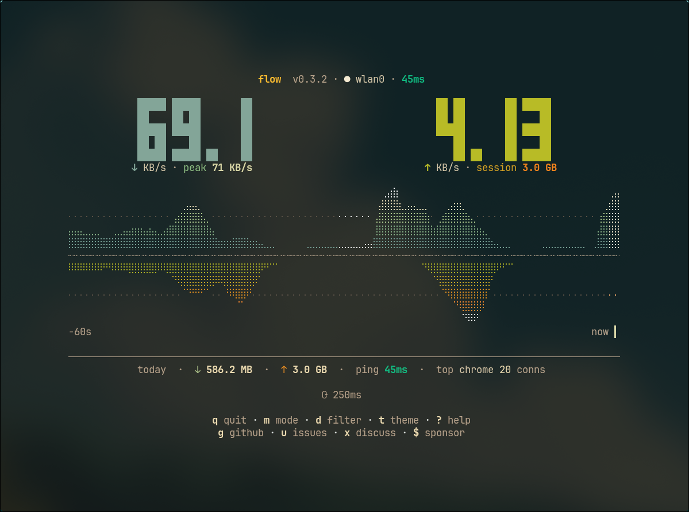

<div align="center">

# flow

**real-time network throughput in your terminal.**



[](https://github.com/programmersd21/flow/actions)
[](https://github.com/programmersd21/flow/releases)
[](https://github.com/programmersd21/flow)
[](license)

</div>

## install

**arch linux**

```sh
yay -S flow-network-monitor-bin
```

**homebrew**

```sh
brew install programmersd21/flow/flow
```

**go**

```sh
go install github.com/programmersd21/flow/cmd/flow@latest
```

make sure `$(go env gopath)/bin` is on your `path`, otherwise your shell
won't find the new binary (and a stale copy elsewhere can shadow it ,
`make install` warns about both).

`--version` reports the real release for every install method: builds carry an
injected version, and `go install` falls back to the module version recorded in
the binary.

or download a binary from [releases](https://github.com/programmersd21/flow/releases).

## usage

```sh
flow                              # hero view (default)
flow --tiny                       # single line, for status bars
flow --mini                       # graphs only
flow --compact                    # condensed numbers
flow --json                       # one JSON snapshot, then exit
flow --json-stream                # newline-delimited JSON, continuous
flow --theme nord --window 5m     # override theme and time window
flow --no-anim                    # disable animations (reduced motion)
flow --format '↓ {{.Down}} ↑ {{.Up}}'   # templated text output
```

when stdout is not a tty (a pipe, a script, a status bar) `flow` prints a
single plain line instead of starting the tui, so it is safe to pipe.

### tmux

```sh
set -g status-right "#(flow --tiny --no-color)"
```

### waybar / polybar / sketchybar / i3blocks

all of them can consume `flow --json-stream` or a fixed-width `--format` line.
see [docs/integrations.md](docs/integrations.md) for copy-paste snippets.

## features

* **mirrored braille waveform**: download above the axis, upload below, rendered on a 2x4-dot braille canvas with a smooth interpolated crest
* **big block digits**: 5x5 bitmap hero numbers (timr-tui technique), chunky enough to read at a glance, tabular so they never jitter
* **calm motion**: spring-driven value easing, an idle breathing pulse, a burst ripple, a pulsing link dot, a 180ms theme crossfade, and a skippable launch sequence, all disabled by `--no-anim`
* **time windows**: `w` cycles 1m / 5m / 15m / 1h / 24h
* **scale modes**: `s` cycles auto / linear / sqrt; `g` toggles the faint midpoint gridline
* **snapshot export**: `s` writes the current frame as `.ansi` and `.txt`
* **11 built-in themes**: `default`, `nord`, `dracula`, `gruvbox`, `forest`, `monochrome`, `catppuccin`, `tokyo-night`, `rose-pine`, `kanagawa`, `ansi`
* **custom toml themes**: load custom color schemes from your config directory (see [docs/themes.md](docs/themes.md))
* **text streams first**: `--json`, `--json-stream`, and `--format` (see [docs/json.md](docs/json.md))
* **no telemetry**: the only network call flow makes is a latency probe to your configured ping target
* **cross-platform**: linux, macos, and windows, on amd64 and arm64, built without cgo
* **pipes cleanly**: not a tty means a single plain line, so status bars never receive escape codes

## keys

| key | action |
| :-: | ------ |
| `q` | quit |
| `m` | cycle view mode |
| `d` | cycle display filter (both / down / up) |
| `t` | theme selector |
| `n` | network processes inspector |
| `i` | cycle network interface |
| `i` | interface details |
| `c` | cycle unit scale (auto / kb/s / mb/s / gb/s) |
| `b` | toggle bits/sec vs bytes/sec |
| `+` / `-` | adjust sampling interval |
| `p` | pause / resume sampling |
| `r` | reset peak counters (press twice) |
| `g` | open github repository in browser |
| `u` | open github issues in browser |
| `x` | open github discussions in browser |
| `$` / `v` | sponsor / donate on github |
| `?` | help menu |
| `w` | cycle time window (1m / 5m / 15m / 1h / 24h) |
| `s` | export snapshot (`.ansi` + `.txt`) |
| `s` | cycle graph scale (auto / linear / sqrt) |
| `g` | toggle gridlines |

## configuration

created automatically on first run:

```text
Linux    ~/.config/flow/config.toml
macOS    ~/Library/Application Support/flow/config.toml
Windows  %APPDATA%\flow\config.toml
```

```toml
refresh     = "100ms"
theme       = "default"
unit        = "auto"
interface   = "auto"
bits        = false
ping_target = "1.1.1.1"
no_anim     = false   # disable animations
```

### environment variables

| variable | effect |
| -------- | ------ |
| `no_color` | disable all ansi color |
| `flow_reduce_motion=1` | reduced motion, same as `--no-anim` |
| `flow_config` | config file path (default: xdg config dir) |
| `flow_data` | directory for persisted daily totals (default: xdg config dir) |
| `flow_glyphs` | force `braille`, `blocks`, or `ascii` waveform glyphs |

## development

```sh
make check
make test
make build
```

## license

mit
